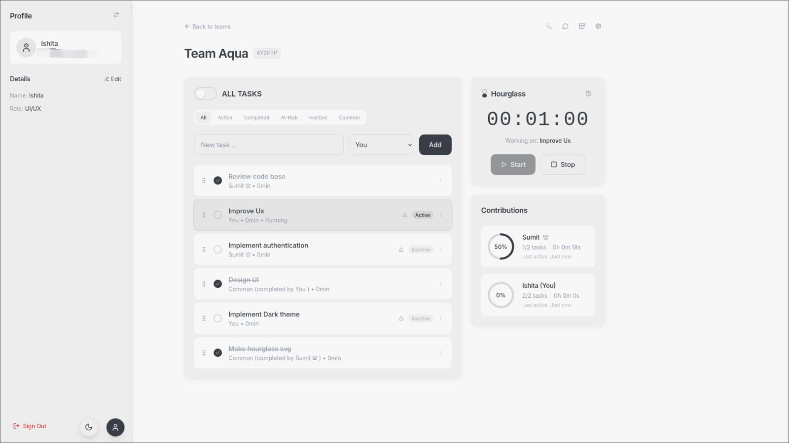
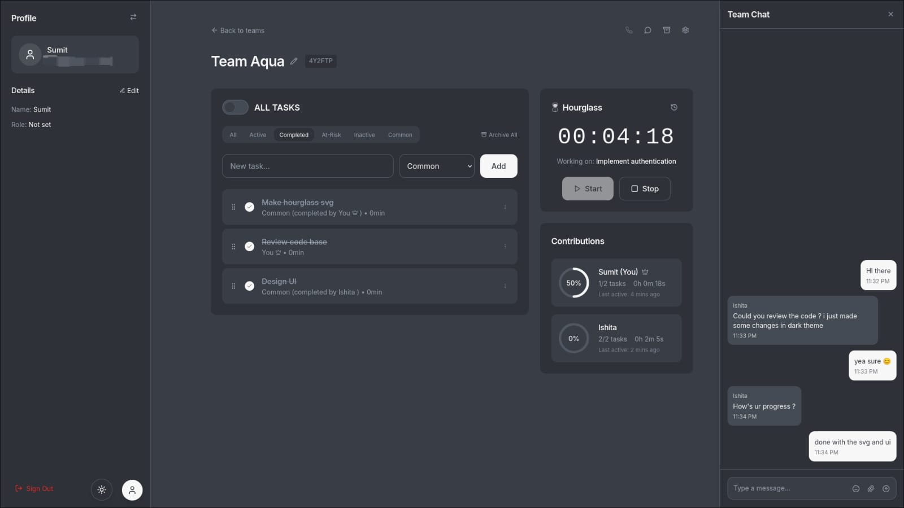

# ContriMeter

A simple way for teams to stay focused and get things done together.



## Intro

Most productivity tools are bloated. We built something minimal that actually helps teams work better - track what matters, see progress in real-time, and keep everyone aligned.

**What you get:**
- Tasks that make sense - Create, assign, drag to reorder. No complexity.
- Time that counts - Built-in timer with a satisfying hourglass animation
- Team awareness - See who's working on what, right now
- Quick communication - Chat without switching apps
- Fair contributions - Track who's pulling their weight
- Your preferred vibe - Dark or light theme



## Getting Started

```bash
git clone https://github.com/realSUDO/ContriMeter.git
cd ContriMeter
npm install
npm run dev
```

That's it. Open localhost and start being productive.


## Tech Stack

Built with React, TypeScript, Firebase, Tailwind CSS. The good stuff, nothing fancy.

## Use Case

Perfect for small to medium teams who want to:
- Track project progress without overhead
- See real-time team activity and contributions
- Communicate quickly without context switching
- Maintain accountability in a fair, transparent way
- Focus on work instead of managing tools

Whether you're a startup, remote team, or project group - ContriMeter keeps everyone aligned and productive.

## License

MIT - use it however you want.
